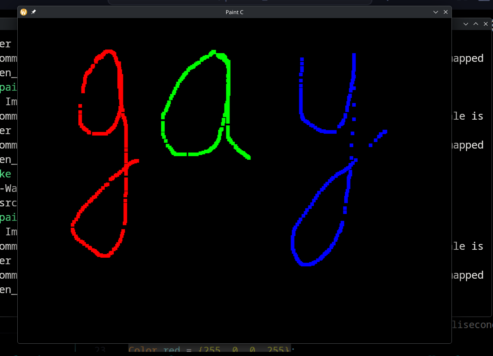

Basic Paint - implemented in C



A simple multi-color brush paint software implemented using SDL2 and C.

Purpose - For personal use & scribbling.


```yml
+------------------------------------------------+
| [COLOR] ====brush====        [ CLEAR ]         |  <- toolbar
+------------------------------------------------+
|                                                |
|              DRAW HERE (CANVAS)                |
|                                                |  <- canvas
|                                                |
+------------------------------------------------+
I am gay
```